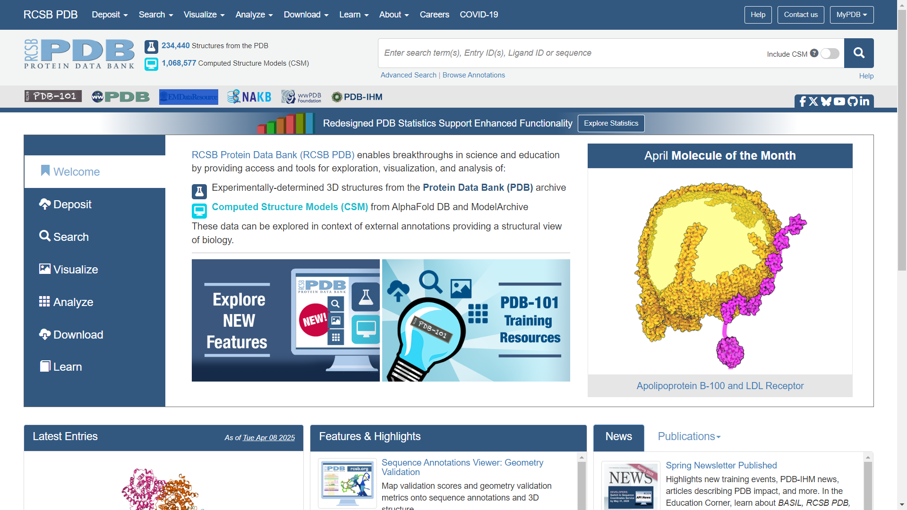

# 化合物检索

## [ChemSpider](https://www.chemspider.com/)

## [PubChem](https://pubchem.ncbi.nlm.nih.gov/)

# 药物检索

## [DrugBank](https://go.drugbank.com/)

## [DrugCentral](https://drugcentral.org/)

## [Drugs](https://www.drugs.com/)

## [Chemical Structure Search](https://go.drugbank.com/structures/search/small_molecule_drugs/structure#results)

# 药物副作用

## [Drug Side Effects](https://www.drugs.com/sfx/)

# 药物相互作用

## [DrugBank](https://go.drugbank.com/drug-interaction-checker)

## [Medscape](https://reference.medscape.com/drug-interactionchecker)

## [Drugs](http://drugs.com/drug_interactions.html)

# 寻找药物

## 通过受体寻找

### [MCE](https://www.medchemexpress.com/search.html?q=product&ft=&fa=&fp=&type=screening-libraries)

## 通过疾病寻找

### [ATC Classification](https://go.drugbank.com/atc)

### [Medscape](https://reference.medscape.com/drugs)

# 医学工具与参考

## [Tools & Reference](https://reference.medscape.com/)

## 药物识别工具

### [Pill Identifier](https://reference.medscape.com/pill-identifier)

## 医学计算器和量表

### [Medical Calculators](https://reference.medscape.com/guide/medical-calculators)

# 数据库

## 临床药物数据库

### [新药情报库](https://synapse.zhihuiya.com/blog)

## 药理学数据库

### [Guide to Pharmacology](https://www.guidetopharmacology.org/)

## 生物活性分子数据库

### [ChEMBL](https://www.ebi.ac.uk/chembl/)

## 蛋白质数据库

### [RCSB PDB](https://www.rcsb.org/)

### [proteins plus](https://proteins.plus/)

### [PDBsum](https://www.ebi.ac.uk/thornton-srv/databases/pdbsum/)

### [UniProt](https://www.uniprot.org/)

### [AlphaFold Protein Structure Database](https://alphafold.ebi.ac.uk/)

# AlphaFold 蛋白质结构预测

## [AlphaFold Server](https://alphafoldserver.com/)

# 计算机辅助药物设计

## CADD

### [CADD Vault](https://drugbud-suite.github.io/CADD_Vault/)

### [SwissDrugDesign](https://www.molecular-modelling.ch/swiss-drug-design.html)

## 先导化合物结构修饰

### [SwissBioisostere](http://www.swissbioisostere.ch/)

### [OptADMET](https://cadd.nscc-tj.cn/deploy/optadmet/checker/)

## 药物分子性质预测

### [SwissADME](http://www.swissadme.ch/)

## 药物分子作用受体预测

### [SwissTargetPrediction](http://www.swisstargetprediction.ch/index.php)

## 药物分子与目标蛋白质相互作用预测

### [SwissDock](https://www.swissdock.ch/)

## 药物相似物查询

### [SwissSimilarity](http://www.swisssimilarity.ch/)

## 分子编辑器和可视化工具

### [Avogadro](https://avogadro.cc/)

### [PyMOL](https://pymol.org/)

# 人类历史上最大的图书馆

## [Anna’s Archive](https://annas-archive.org/)

# 人类历史上最大的书架

## [ISBN Visualization](https://phiresky.github.io/isbn-visualization/?)

# 化学工具包

## [Chemistry Toolkit](https://www.stolaf.edu/depts/chemistry/courses/toolkits/)

## [ChemInfoGraphic](https://cheminfographic.wordpress.com/)

# 精神维基百科

## [Psychonaut Wiki](https://psychonautwiki.org/wiki/Main_Page)

# 益智药

## [NootropicsExpert](https://nootropicsexpert.com/)

